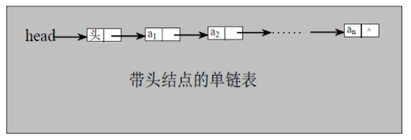
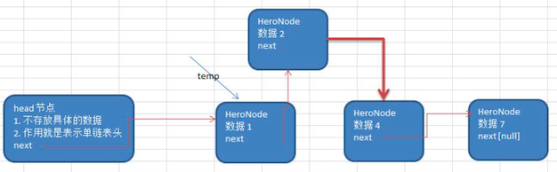

# 链表
## 单链表
单链表**逻辑结构**如下，当一个节点为空的时候，该链表就结束了

单链表无排序实现
[代码](linked.java)

### 单链表 有序实现

添加思路如下：
首先 找到 新添加节点的位置，通过辅助变量 temp，然后循环遍历查找
新的节点.next = temp.next
将 temp.next = 新的节点

代码实现，在原有的基础上新增了一个添加方法”addByOrder“
