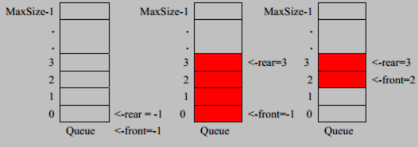

# 队列
### 基本介绍
队列：是一个**有序列表**，可以用**数组**或**链表**实现。
特点：遵循**先入先出**原则。既：先存入的数据先取出。

示意图：

中图：存入数据

右图：取出数据，从队首取
## 数组模拟队列
队列本身是**有序列表**，使用数组结构来存储队列的数据，则如前面基本介绍中的示意图一样。

声明 4 个变量：

* arr：用来存储数据的数组
* maxSize：该队列的最大容量
* front：队首下标，随着数据输出而改变
* rear：队尾下标，随着数据输入而改变

队列中常用操作分析，以 add，把数据存入队列为例，思路分析：

1. 将尾指针往后移：rear + 1，前提是当 front == rear 时，队列是空的
2. 若尾指针 rear < maxSize -1：
* 则将数据存入 rear 所指的数组元素中，
* 否则无法存入数据。rear = maxSize -1 表示队列满了

以上思路是一个最基本的实现（不是完美的，看完代码就明白了）。代码实现如下：

[代码](queue.java)