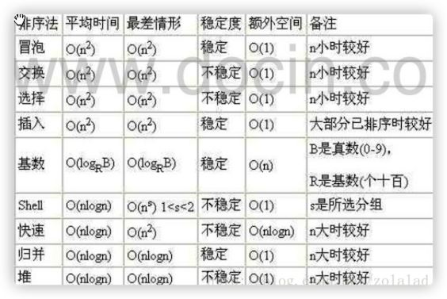

# 排序
### 排序的分类
分两类：内部排序、外部排序
* 内部排序：
指将需要处理的所有数据，都加载到**内部存储器**（内存）中进行排序
  
* 外部排序：
**数据量过大**，无法全部加载到内存中，需要借助**外部排序**（文件等）进行排序。
  
### 常见的排序分类

内部排序（内存） 
  
> 插入排序
* 直接插入排序
* 希尔排序
> 选择排序
* 简单选择排序
* 堆排序
> 交换排序
* 冒泡排序
* 快速排序
> 归并排序

> 基数排序

外部排序（使用内存和外存结合）
### 算法时间复杂度
衡量算法的性能的好坏，可以使用时间时间复杂度

度量 一个程序（算法）执行时间的两种方法：

* 事后统计法

简单说：就是把程序运行起来，然后查看运行完成的总时间。

但是有一个问题：所统计的时间，依赖于计算机的硬件、软件等环境因素。如果要使用这种方式，需要在同一台计算机相同状态下运行程序，才能比较哪个算法速度更快

* 事前估算法

通过分析某个 算法的时间复杂度 来判断哪个算法更优
#### 时间频度
一个算法 花费的时间 与算法中 语句的执行次数 成正比，哪个算法中语句执行次数多，它花费时间就多。一个算法中的 语句执行次数称为语句频度或时间频度。记为 T(n)

对于时间频度，有如下几个方面可以忽略
* 忽略常数项
* 忽略低次项
* 忽略系数

平均时间复杂度和最坏时间复杂度是否一致，和算法有关，如下图：

## 冒泡排序
### 基本介绍
冒泡排序（Bubble Sorting）的基本思想：通过对待排序序列 从前向后（从下标较小的元素开始），依次比较相邻元素的值，若发现逆序则交换，使值较大的元素逐渐从前移向后部，就像水底下的旗袍一样逐渐向上冒。

优化点：因为排序过程中，个元素不断接近自己的位置，如果一趟比较下来没有进行过交换，就说明序列有序，因此要在排序过程中设置一个标志判断元素是否进行过交换。从而减少不必要的比较。（该优化点可以在完成基本的冒泡排序之后再做）

[代码](bubble_sort.java)
## 选择排序
### 基本介绍
选择排序也属于内部排序法，是从欲排序的数据中，按指定的规则选出来某个元素，再依规定交换位置后达到排序的目的。
选择排序（select sorting）也是一种简单的排序方法。

基本思想为：

* 第一次从 arr[0]~arr[n-1] 中选取最小值，与 arr[0] 交换
* 第二次从 arr[1]~arr[n-1] 中选取最小值，与 arr[1] 交换
* 第 i 次从 arr[i-1]~arr[n-1] 中选取最小值，与 arr[i-1] 交换
* 依次类图，总共通过 n - 1 次，得到一个按排序码从小到大排列的有序序列

[代码](select_sort.java)
## 插入排序
### 基本介绍
插入排序属于内部排序法，是对于欲排序的元素以**插入的方式寻找该元素的适当位置**，以达到排序的目的。
### 基本思想
插入排序（Insertion Sorting）的基本思想是：

1. 把 n 个待排序的元素 看成 为一个 有序表 和 无序表
2. 开始时，有序表中只包含一个元素，无序表中包含有 n - 1 个 元素

排序过程中每次 从无序表中取出第一个元素，把它的排序码 依次与有序表元素的排序码进行比较，将它插入到有序表中的适当位置，使之成为新的有序表。
