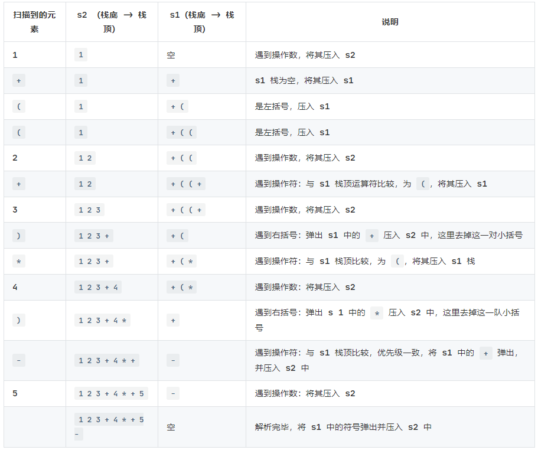

通过逆波兰计算器的代码实现，可以看到：后缀表达式对于计算机来说很方便，但是对于人类来说，后缀表达式却不是那么容易写出来的。

中缀表达式转后缀表达式步骤：

1. 初始化两个栈：
* 运算符栈：s1
* 中间结果栈：s2
2. 从左到右扫描中缀表达式
3. 遇到操作数时，将其压入s2
4. 遇到运算付时，比较他与s1栈顶运算付的优先级：
* 如果s1为空，或则栈顶运算付为'（'，则将其压入符号栈s1
* 如果：优先级比栈顶运算符高，也将其压入符号栈s1
* 如果：优先级比栈顶运算符 低 或 相等，将 s1 栈顶的运算符 弹出，并压入到 s2 中
5. 遇到括号时：
* 如果是左阔号'('：则直接压入s1
* 如果是右括号：则依次弹出s1栈顶的运算符，并压入s2，直到遇到左括号为止，将这对括号丢弃
6. 重复步骤2到5，直到表达式最右边
7. 将s1中的运算符依次弹出并压入s2
8. 依次弹出 s2 中的元素并输出，结果的 逆序 即为：中缀表达式转后缀表达式

举例说明：
将中缀表达式：1+((2+3)*4)-5 转换为后缀表达式

由于 s2 是一个栈，弹出是从栈顶弹出，因此逆序后结果就是 1 2 3 + 4 * + 5 -